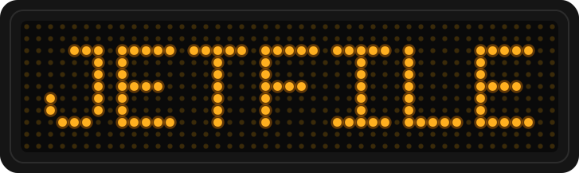

<div align="center">



# jetfile-signage

**A pure-Go client for LED message signs that speak the JetFile II protocol.**

Drive Chainzone / Texcellent *Sigma 3000*-class boards — and the many
rebranded signs built on them (Eurolite ESN, 4U2SEE, …) — straight from Go.
Scrolling text, live clock/temperature inserts, images, playlists, the
on-board filesystem and raw pixel streaming, all over plain TCP/UDP.

[](https://pkg.go.dev/github.com/schinken/jetfile-signage/jetfile)
[](go.mod)

</div>

---

Implements the binary communication format of spec **v2.5.4**
(`docs/JetFileII_v2.5.4.pdf`) over TCP/UDP port **9520**, plus the lightweight
ASCII "first format" for quick fire-and-forget updates.

- **Zero dependencies** — standard library only.
- **Fully unit-tested** against an in-memory fake sign (`net.Pipe`); no
  hardware required to hack on it.
- **Complete command coverage** — text/string/picture files, playlists,
  clock, power, brightness, display tests, the FAT-style filesystem, pixel
  streaming and login, plus a `Do()` escape hatch for anything unwrapped.
- **A fluent text builder** for the display control characters — fonts,
  colors, animations, alignment and live clock/temperature inserts.

```sh
go get github.com/schinken/jetfile-signage/jetfile
```

## Supported hardware

JetFile II is the protocol of **[Chainzone Technology](https://www.chainzone.com/)**
(also OEM-branded **Texcellent**), driven on the desktop by their *Sigma 3000 /
Sigma Play* software. A large family of signs — many rebadged for Western
distributors — speak it. If your board came with Sigma 3000-style software or
is listed below, this library should talk to it.

| Sign / family | Vendor | Notes |
|---|---|---|
| *Sigma 3000*-compatible signs | [Chainzone / Texcellent](https://www.chainzone.com/) | The reference hardware for the protocol. |
| **Eurolite ESN** series (ESN 7×80, 16×64, 16×256, …) | [Eurolite](https://www.eurolite.de/) / [Steinigke Showtechnic](https://www.steinigke.de/en/mpn80500107-eurolite-esn-7x80-usb-lan-led-moving-message.html) | Widely-sold rebadged JetFile sign; the hardware this library was built against. |
| **4U2SEE** indoor/outdoor tricolour displays | [Electro-Matic Visual](https://visual.electro-matic.com/led-signs/) | Sigma 3000-controlled; sold in the US. |
| **Hyperion** displays | — | Named alongside 4U2SEE in Sigma 3000; vendor unconfirmed. |
| **MVS 780RG** moving-message sign | — | Reported to speak JetFile II over IP; vendor unconfirmed. |

Resellers/integrators that ship JetFile signs and Sigma software include
[I.B.O. Associates](https://www.iboassociates.com/) (US) and
[London Electronics](http://www.london-electronics.com/) (UK, hosts a public
copy of the protocol spec).

> The Chainzone lineage is well attested; several rebrands (Eurolite ESN in
> particular) ship the hardware without ever naming the protocol, so those
> links are inferred from matching wire behaviour. If you confirm a board —
> or find a new one — a PR to this table is very welcome.

Cross-referenced against the independent reverse-engineering in
[johnoneil/LEDSign](https://github.com/johnoneil/LEDSign) (a serial-port
Sigma 3000 client) and the earlier UDP implementation
[schinken/Eurolite-ESN-Ledboard](https://github.com/schinken).

## Quick start

```go
c, err := jetfile.Dial("10.0.0.42") // port defaults to :9520
if err != nil { ... }
defer c.Close()

ctx := context.Background()

// say hello
msg := jetfile.NewText().
	Font(jetfile.Font7x6).
	Color(jetfile.ColorRed).
	In(jetfile.EffectMoveLeft).
	Str("Hello").
	Pause(3 * time.Second)
err = c.WriteTextFile(ctx, "0", msg)

// keep the sign's clock right
err = c.SetClock(ctx, time.Now())

// what's it doing?
status, err := c.SystemStatus(ctx)
```

## Examples

Runnable programs live under [`examples/`](examples/) — each takes `-addr HOST`:

| Example | What it shows |
|---|---|
| [`basic`](examples/basic) | Connect, print the sign's parameters, sync the clock, display a message. |
| [`dashboard`](examples/dashboard) | A multi-page info display — banner, live clock/date, and a temperature/humidity page read off the sign's sensors. Deep dive on the text builder. |
| [`ticker`](examples/ticker) | A live ticker: every line piped on stdin scrolls across the board, written to the RAM disk to spare the flash. Graceful Ctrl-C. |
| [`fsutil`](examples/fsutil) | A little `ls` / `df` / `cat` / `rm` CLI for the sign's on-board filesystem, with `*DeviceError` handling. |

```sh
go run ./examples/dashboard -addr 10.0.0.42 -name "b4ckspace"
tail -F /var/log/alerts | go run ./examples/ticker -addr 10.0.0.42
go run ./examples/fsutil  -addr 10.0.0.42 df D
```

## Text builder

`jetfile.NewText()` builds text/string file content from the protocol's
display control characters. Everything chains:

| Method | Effect |
|---|---|
| `Str`, `Strf`, `Line`, `Frame` | content, new line, new page (`\n` in `Str` = new line) |
| `Font`, `Color`, `ColorRGB`, `Background` | typography and palette |
| `In`, `Out`, `Speed`, `Pause`, `Flash` | frame animations and timing |
| `AlignH`, `AlignV`, `LineSpacing` | layout |
| `Special` | live clock / date / temperature / humidity inserts |
| `InsertString`, `InsertPicture` | embed other files |
| `Raw` | any control sequence without a helper |

## Command coverage

| Protocol area | Methods |
|---|---|
| Info (0x01, 0x03) | `ConnectionTest`, `SystemParams`, `SystemStatus`, `SNMAC`, `SystemInfo` |
| Files: labeled (0x0104-07, 0x0204-07) | `ReadTextFile`, `ReadStringFile`, `ReadPictureFile`, `WriteTextFile`, `WriteStringFile`, `WritePictureFile` |
| Files: paths & system (0x0102/0202, 0x0108/0208) | `ReadSystemFile`, `WriteSystemFile` (playlist etc.), `ReadFile`, `WriteFile` |
| Emergency / brightness (0x0209, 0x020A) | `WriteEmergency`, `SetBrightness` |
| Display tests (0x03) | `StartTest`, `EndTest`, `GrayscaleTest` |
| Black screen / power (0x04) | `BlackScreen`, `Reset`, `PowerOff`, `PowerOn`, `PowerStatus` |
| Clock (0x05) | `Clock`, `SetClock` (BCD, time zone codes, legacy fallback) |
| Play control (0x06) | `RestartPlaylist`, `ReplayCurrent`, `Pause`, `Resume`, `PlayNext`, `PlayPrevious`, `PlayFile`, `CurrentFile`, `SetBuzzer` |
| File control (0x07) | `FormatPartition`, `Mkdir`, `Rename`, `Move`, `Remove`, `RemoveAll`, `ReadDir`, `DiskInfo`, `FileExists` |
| Pixel streaming (0x08) | `StartStream`, `StreamData`, `StreamStatus`, `StopStream` |
| Login (0x0A) | `Login`, `Logout`, `ChangePassword` |
| First format | `WriteTextSimple`, `SendSimple` (fire-and-forget, e.g. RAM-disk updates) |

Writes are split into ordered 512-byte packets, reads are reassembled from
pages automatically. Failures surface as `*jetfile.DeviceError` carrying
the sign's status code:

```go
if errors.Is(err, &jetfile.DeviceError{Code: jetfile.StatusFileNotFound}) { ... }
```

### Anything else: the escape hatch

Commands without a wrapper (absolute address access, font uploads, CPU
update checks, non-word-wrap mode …) can be sent raw; framing, checksum,
serial matching and status mapping still apply:

```go
resp, err := c.Do(ctx, &jetfile.Packet{Cmd: 0x0901, Arg: []byte{0, 0, 3, 0}})
```

## Notes for hardware

- Signs listen on TCP **and** UDP 9520. For UDP, bring your own conn:
  `jetfile.NewClient(udpConn)`.
- Multiple signs on one bus: `jetfile.WithAddress(group, unit)`;
  the default is broadcast (0, 0).
- `jetfile.WithPartition('E')` targets the RAM disk — no flash wear for
  content that updates often. Flash (`'D'`, default) survives power cycles.
- Checksum is the 16-bit truncated byte sum from the length field to the
  end of the frame; verified against the spec's appendix and the
  independent [johnoneil/LEDSign](https://github.com/johnoneil/LEDSign)
  implementation. Field order and quirks (BCD clock, reversed IP bytes,
  FAT directory entries) come straight from the spec's tables.

## Testing

Everything is unit-tested against an in-memory fake sign (`net.Pipe`), no
hardware needed:

```sh
go test ./...
```

## References

- `docs/JetFileII_v2.5.4.pdf` — the protocol spec this implements
- [johnoneil/LEDSign](https://github.com/johnoneil/LEDSign) — independent
  reverse-engineering of a Sigma 3000 serial client, used to cross-check the
  checksum and framing
- [b4ckspace/ledboard-v2](https://github.com/b4ckspace/ledboard-v2) — the
  previous UDP/first-format implementation this library replaces
